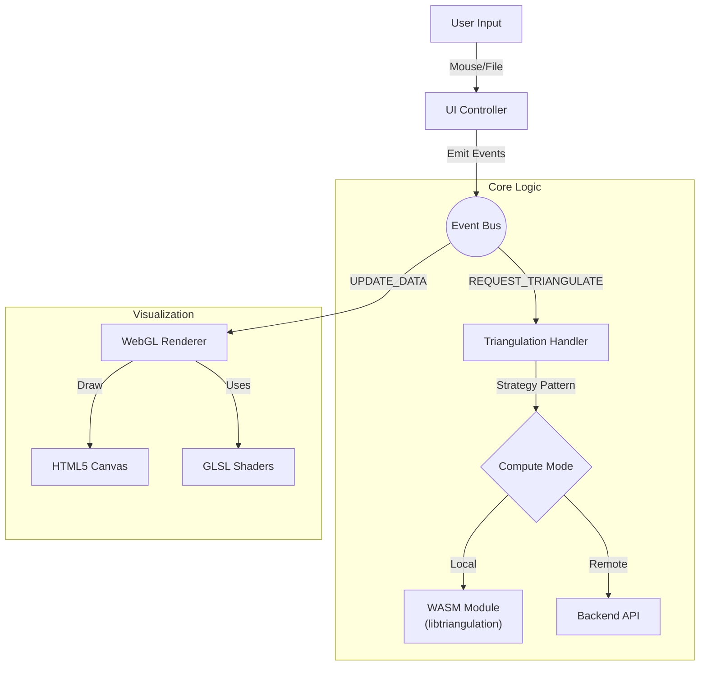

# 🌐 2D Polygon Triangulator (WebGL + WASM Frontend)


<div align="center">
  
  <p><em>Interactive geometric processing with real-time WebGL rendering and client-side WASM compute.</em></p>
</div>

## 📖 Overview

This is the **frontend client** for the Polygon Triangulator system. It demonstrates a high-performance web architecture that leverages **WebAssembly (WASM)** to run complex C++ geometric algorithms directly in the browser, while also offering a fallback to a REST API microservice.

Built with **vanilla WebGL** (no heavy engines) and **modern ES6 modules**, it serves as a reference implementation for integrating native code into web applications.

## 🚀 Engineering Highlights

- **Hybrid Compute Model**: Users can toggle between **Client-side (WASM)** execution for low-latency/offline processing and **Server-side (API)** execution for distributed loads.
- **Custom WebGL Renderer**: Implements a zero-dependency rendering engine with custom Vertex/Fragment shaders, optimizing performance for geometric primitives.
- **Shared C++ Codebase**: The core triangulation logic (`libtriangulation`) is shared between the C++ Backend and this Frontend via **Emscripten**, ensuring 100% algorithm consistency.
- **Event-Driven Architecture**: Uses a decoupled event bus (`mitt`) to separate UI logic, geometric processing, and rendering pipelines.

## 🛠️ Tech Stack

| Component          | Technology             | Description                                                 |
| :----------------- | :--------------------- | :---------------------------------------------------------- |
| **Core Runtime**   | **WebAssembly (WASM)** | Compiled C++ modules for near-native performance.           |
| **Rendering**      | **WebGL API**          | Custom shader-based renderer for points, lines, and meshes. |
| **Language**       | **JavaScript (ES6+)**  | Modern, modular JS without build-step complexity.           |
| **Math**           | `gl-matrix`            | High-performance matrix/vector operations for graphics.     |
| **Communication**  | `mitt`                 | Tiny functional event emitter for loose coupling.           |
| **UI Feedback**    | `notyf`                | Toast notifications for async operation status.             |
| **Infrastructure** | Docker / Nginx         | Production-ready containerized serving.                     |

## ⚡ Quick Start

### Option A: Docker (Recommended)

Run the fully containerized environment (served via Nginx).

```bash
# Build and run the frontend container
docker build -t triangulator-frontend .
docker run -p 3000:80 triangulator-frontend
```

Access at `http://localhost:3000`

### Option B: Local Development

Requires Node.js (for serving) and Python (optional alternative).

```bash
# 1. Install dependencies
npm install

# 2. Start local dev server
npm start
# Server runs on http://localhost:8000
```

> **Note**: For WASM functionality, the `wasm/` directory must be served with correct MIME types (handled automatically by the included servers).

## 🏗️ Architecture

The frontend follows a strictly modular architecture where the **Renderer** is isolated from the **Business Logic**.



## 🧩 Key Features

### 1. Dual-Mode Processing

- **WASM Mode**: Runs `libtriangulation.wasm` in the browser main thread. Zero network latency.
- **API Mode**: Sends JSON payloads to the C++ Microservice. Useful for benchmarking or thin-client scenarios.

### 2. Custom Shader Pipeline

Unlike libraries like Three.js, this project implements raw WebGL for educational clarity and performance control:

- **`line.vert/frag`**: Handles polygon outlines using `GL_LINES`.
- **`triangle.vert/frag`**: Renders the resulting mesh using `GL_TRIANGLES`.

### 3. Build Pipeline

The project includes scripts to compile the C++ source into WASM artifacts using Dockerized Emscripten, ensuring reproducible builds without local toolchain installation.

```bash
# Compiles C++ -> WASM
npm run build:wasm
```

## 📄 License

MIT License.

---

**Part of the 2D Polygon Triangulator System** [GitHub Repository](https://github.com/jesusizq/2DPolygonTriangulator/)
